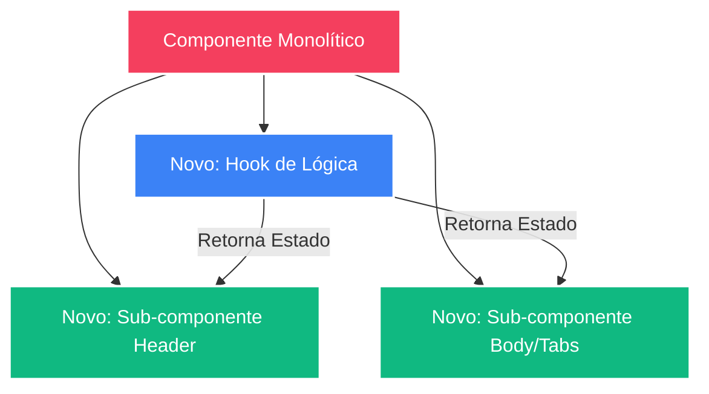

# Frontend Architecture & Linting Backlog

> **Status:** 🟡 Planejamento (Aguardando Aprovação) | **Squad:** Orquestrador, PM, Designer, Dev, QA, Deployer

Este documento centraliza as definições do time sênior (Squad) para resolver os débitos técnicos de UI/UX, arquitetura de componentes e Linter.

---

## 👔 Fase 1: Escopo e Negócio (Subagente: PM)

**Objetivo (Agile Chunking):** Fatiar as três grandes frentes do Backlog em Sprints gerenciáveis para não quebrar a aplicação em produção.

- `[ ]` **Sprint 1: Preparação e Linter**
  - Adicionar as pastas `/scratch` e `/scripts` no `.eslintignore` (já que são experimentais/scripts soltos de Dev).
- `[ ]` **Sprint 2: UI e Design System (Tailwind)**
  - Remover estilos inline (`style={{...}}`) e adotar Tailwind nos componentes:
    - `calculator-skill-tooltip.tsx`
    - `calculator-monster-icon.tsx`
    - `calculator-item-icon.tsx`
    - `calculator-card-enchant-modal.tsx`
- `[ ]` **Sprint 3: Arquitetura de Componentes e Hooks (Desmembramento)**
  - **`calculator-item-preview.tsx` (20kb):** 
    - Extrair a lógica pesada de cálculo de status base/refino/grau para um custom hook isolado (`use-item-preview-effects.ts`).
    - Fatiar a interface em subcomponentes menores.
  - **`calculator-derived-stats.tsx` (18kb):** 
    - Separar blocos de renderização de status.

---

## 🎨 Fase 2: Especificação Visual (Subagente: DESIGNER)

Nesta fase, garantimos que a remoção dos estilos inline `style={{...}}` não quebrará a interface, pois converteremos as propriedades diretamente para tokens do nosso **Tailwind CSS**.

### Diagrama de Refatoração de Componentes

---

## 🚧 Notas Técnicas (Aguardando Fase 3 - DEV)
*A ser preenchido pelo subagente DEV após aprovação do Escopo/Design.*
